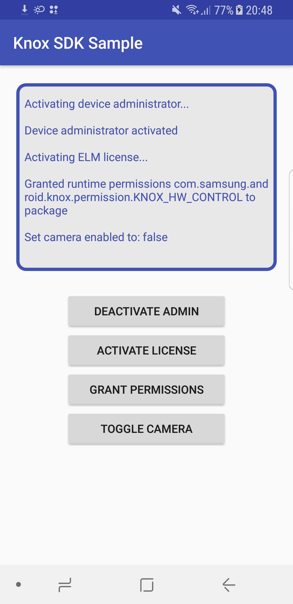

Knox SDK Sample
===================================

This sample shows a simple application to toggle the device camera restriction policy on/off.

Introduction
------------

The Samsung Knox SDK combines existing enterprise and security SDKs into one SDK.

Pre-requisites
--------------

Knox SDK, device that supports Knox API level 24

Screenshots
-------------

Getting Started
---------------

This sample uses the Gradle build system. To build this project, use the
"gradlew build" command or use "Import Project" in Android Studio.

Support
-------

- Samsung Enterprise Alliance Program (SEAP) Developer Community: https://seap.samsung.com/forum

License
-------

DISCLAIMER: PLEASE TAKE NOTE THAT THE SAMPLE APPLICATION AND SOURCE CODE DESCRIBED HEREIN IS PROVIDED FOR TESTING PURPOSES ONLY.

 

Samsung expressly disclaims any and all warranties of any kind, whether express or implied, including but not limited to the implied warranties and conditions of merchantability, fitness for a particular purpose and non-infringement. Further, Samsung does not represent or warrant that any portion of the sample application and source code is free of inaccuracies, errors, bugs or interruptions, or is reliable, accurate, complete, or otherwise valid. The sample application and source code is provided "as is" and "as available", without any warranty of any kind from Samsung.

Your use of the sample application and source code is at its own discretion and risk, and licensee will be solely responsible for any damage that results from the use of the sample application and source code including, but not limited to, any damage to your computer system or platform. For the purpose of clarity, the sample code is licensed “as is” and licensee bears the risk of using it.

Samsung shall not be liable for any direct, indirect or consequential damages or costs of any type arising out of any action taken by you or others related to the sample application and source code.